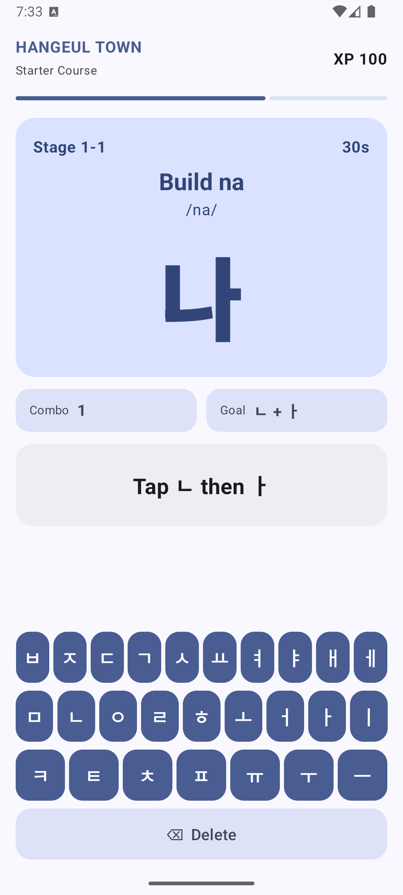
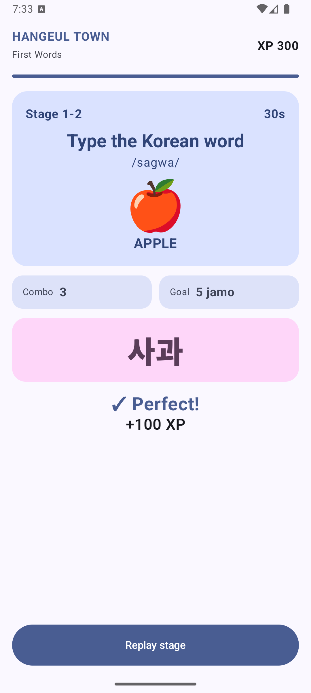

# Hangeul Town

Hangeul Town은 외국인 학습자가 한글이 조립되는 원리를 게임처럼 배우고, 실제 한국어 타이핑까지 연습할 수 있도록 만든 스마트폰 Android 앱입니다.

## 스크린샷

<p>
  
  
</p>

## 핵심 기능

- 자모 입력에 따라 글자가 실시간으로 조립되는 한글 조합 시스템
- 두벌식 구조를 바탕으로 한 앱 내부 한글 키보드
- 자모가 합쳐져 음절과 단어가 되는 머지 애니메이션
- 이모지, 영어 뜻, 로마자 발음 힌트를 활용한 초급 단어 챌린지
- XP, 콤보, 스테이지 클리어 보상
- Android TextToSpeech 기반 한국어 발음 재생

## 현재 플레이 가능한 스테이지

현재 첫 플레이어블 버전에서는 다음 글자와 단어를 학습합니다.

- 가
- 나
- 사과
- 우유
- 커피
- 바나나

스테이지를 끝까지 완료하면 현재 기준 950 XP와 6 콤보에 도달합니다.

## 기술 스택

- Kotlin
- Jetpack Compose
- Material 3
- Android ViewModel과 StateFlow
- Android TextToSpeech

## 빌드

```powershell
.\gradlew.bat testDebugUnitTest assembleDebug
```

스마트폰 에뮬레이터에서 Android 연결 테스트를 실행하려면 다음 명령을 사용합니다.

```powershell
.\gradlew.bat connectedDebugAndroidTest
```
